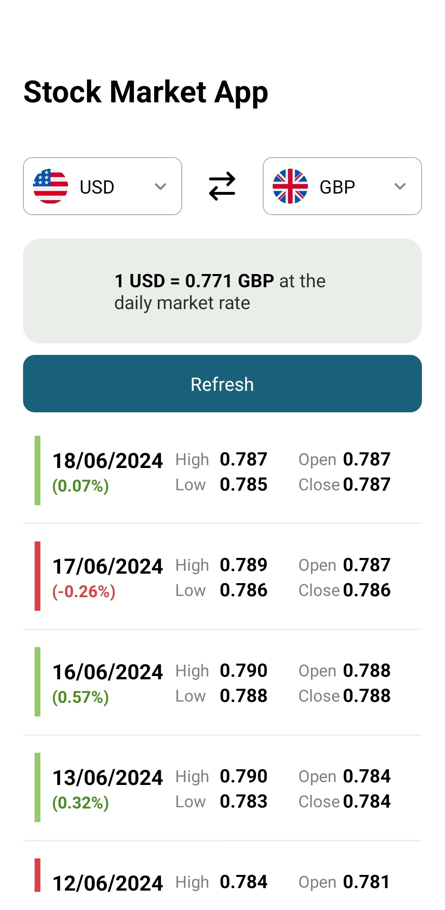

# vfxFinancial

<p align="center">
  
</p>

API Documentation [Alpha Vantage API](https://www.alphavantage.co/documentation/#)

## About:
vfxFinancial is a frontend mobile app developed as part of the technical test for VFX Financial. It utilizes the Alpha Vantage API to simulate a fintech application that fetches and displays historical stock prices with detailed information including Open, High, Low, and Close values. Users can select from three currencies (GBP, EUR, USD) to monitor various currency pairs. The intuitive interface allows users to switch between currency, and the data table updates automatically to reflect the latest values. A refresh button is also available for users to manually update the data.

## Functionalities:
- [x]  <strong>Frontend consuming external API:</strong> React native frontend app that consumes the Alpha Vantage API with axios to fetch data using this endpoint: https://www.alphavantage.co/query?function=FX_DAILY&from_symbol=EUR&to_symbol=USD&apikey=receivedkeyhere.
- [x]  <strong>Dropdown:</strong> Two dropdown lists for each currency, using the react-native-element-dropdown library for a better UI that works on both iOS and Android. A reusable currencyPicker component was built for both lists.
- [x]  <strong>Historical stock prices list:</strong> A screen to show historical stock prices in a list where items have Open, High, Low and Close values.
- [x]  <strong>Clear and Accessible Values:</strong> Displays the percentage of stock price increase or decrease compared to the previous date, with a color scheme to indicate changes. Also includes a card showing the latest close value at the top of the list for easy viewing.
- [x]  <strong>Scalable:</strong> Scalable code using a useStockData hook, StockList, and API service that can be reused for other API calls like FX_WEEKLY or FX_MONTHLY. Componentization helps organize, read, and update the code.
- [x]  <strong>Refresh automatically:</strong> Table update automatically when currency pairs are changed.
- [x]  <strong>Refresh button:</strong> User has the ability to refresh the View with the latest values using a button.
- [x]  <strong>Tests:</strong> The critical tests were made with Jest to verify the core functionality and UI rendering. There are unit and integration tests to ensure the currency swap logic functions correctly and stock data renders properly.
- [x]  <strong>Swap button:</strong> A swap button to change the selected currencys and images of the flags of each currency were implemented to help the user experience.

## To improve:
- [x]  <strong>More tests:</strong> Current tests cover only critical features. Additional tests, such as unit tests for all components, interface tests, and end-to-end tests, could be implemented.  Also automating the tests to be trigged in every commit.
- [x]  <strong>Loading UI:</strong> The app currently shows a loading text, but this could be improved with libraries for animated and dynamic loading effects.
- [x]  <strong>Search for dates:</strong> Users could input a date in a search bar to request specific dates.
- [x]  <strong>Image to svg:</strong> Flag images could be changed to SVG files for a more pixel-perfect effect, similar to the swap button icon.
- [x]  <strong>Pagination:</strong> The list of historical prices could have pagination to limit the number of items shown on each page.
- [x]  <strong>Dependencies:</strong> To install the dependencies the legacy-peer-deps must be used. This works as a temporary solution, but it's better to update the testing dependencies to ensure compatibility and long-term stability.

## How to run the front-end project:

```bash
# Clone the project's repository:
    git clone https://github.com/ojoaoneiva/vfxFinancial.git

# Enter the front-end folder:
    cd vfxFinancial/
    cd stockMarketApp

# Install the app's dependencies:
    npm i --legacy-peer-deps

# Create a .env file following the example of the env.example file to add you API KEY. The Free API Key can be claimed following this https://www.alphavantage.co/support/#api-key , but is important to know that the free API Key only accepts up to 25 requests per day.

# Run the application:
    npm run android
    or
    npm run ios

# The server will start on Expo Development.
# Use the Expo Go app on your Android or iOS mobile device to enter the given url on the terminal (similar to this exp://192.168.1.3:8081), or use an emulator for desktop viewing.

```

## Technologies used:
- React Native
- Jest
- Axios
